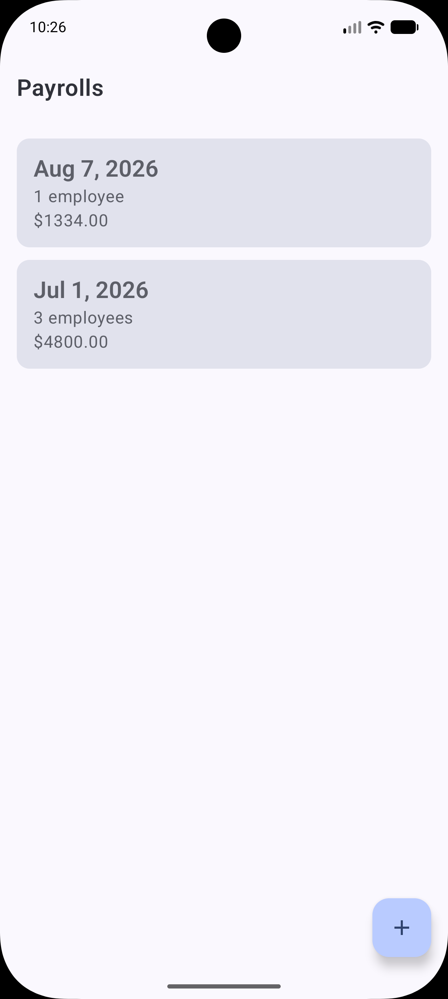
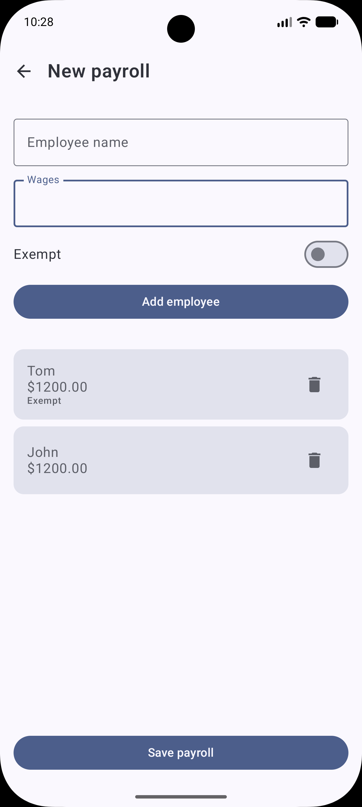
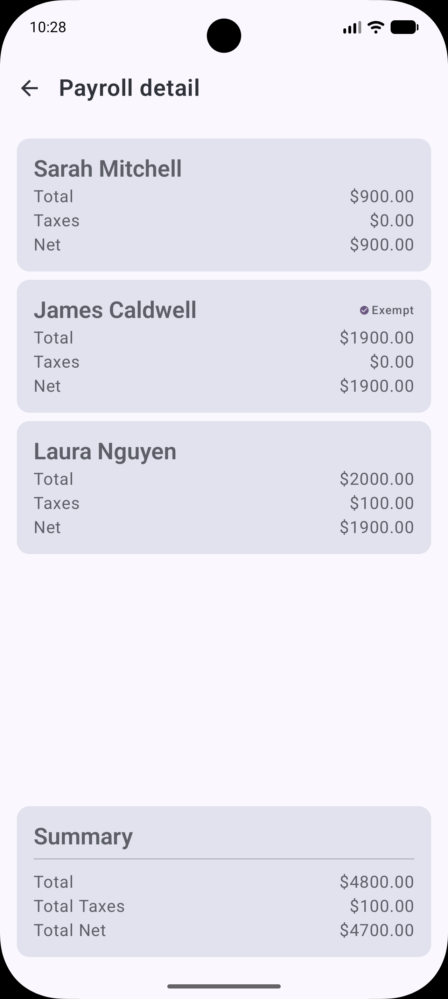
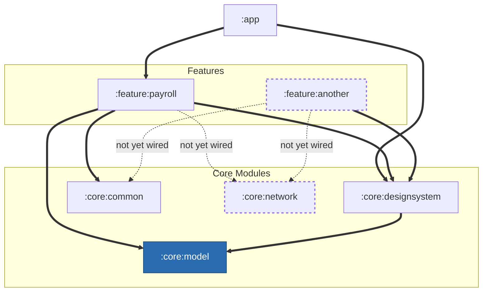

# Payroll


A feature-first, multi-module Android app for creating payroll runs, listing them, and reviewing
a per-employee tax breakdown.

---

## Run It

```bash
git clone <repo-url> && cd Payroll
./gradlew installDebug              # build + install on a connected device/emulator
./gradlew test                      # run local unit tests
./gradlew connectedDebugAndroidTest # run the Room DAO instrumented test (needs a connected device/emulator)
```

Requires JDK 17 and an Android SDK with the `compileSdk 37` platform installed. No API keys or
backend setup needed — the app seeds itself with one sample payroll on first launch and works
fully offline after that.

---

## What It Does

- **List** — every payroll created, with employee count and total wages.
- **Create** — add employees (name, wages, exempt flag) and save a new payroll; it appears in the
  list immediately, no manual refresh.
- **Detail** — per-employee tax breakdown (5% tax if wages > 1,000 and not exempt) plus a
  run-level summary.

---

## Screenshots

<table>
  <tr>
    <td align="center">
      
      <br/><sub><b>List</b></sub>
    </td>
    <td align="center">
      
      <br/><sub><b>Create</b></sub>
    </td>
    <td align="center">
      
      <br/><sub><b>Detail</b></sub>
    </td>
  </tr>
</table>

---

## Architecture

**Feature-first.** Each feature owns its complete stack — presentation, domain, and data — instead
of business logic and data access living in shared "global" modules. `:feature:payroll` contains
its own screens/ViewModels, its own `PayrollRepository` interface *and* implementation, its own
Room entities/DAO, and its own (mocked) remote data source. No feature depends on another feature.

```
Compose UI → ViewModel → Use Case → Repository (interface) → Repository (impl) → Room / mocked network
```



Bold/solid arrows are real, in-use dependencies. Dashed nodes and arrows are built and compile but
nothing in the app's build reaches them yet:

- **`:feature:another`** only depends on `:core:designsystem` today; `:core:common` and `:core:network`
  are dashed because nothing in the module uses them yet. It's also not reachable at all from `:app`
  — `:app` doesn't depend on `:feature:another`, so it's not part of the installed app, only
  buildable directly.
- **`:core:network`** has no project dependencies today. Both dashed arrows into it show where it
  *would* plug in — a feature adding a Retrofit service interface on top of its shared
  `Retrofit`/`OkHttpClient`/`Json` — once there's a real backend to call. `:feature:payroll`'s
  `PayrollRemoteDataSource` is still `FakeRemoteDataSource` only, so neither edge exists yet.

| Module | Responsibility |
|---|---|
| `:feature:payroll` | Everything payroll: Compose screens/ViewModels/UiStates, the `PayrollRepository` interface and its implementation, Room entities/DAO, the mocked remote data source, and Hilt bindings for all of it. |
| `:feature:another` | An intentionally empty module — proof the module template scales to a second feature with no extra setup. |
| `:core:model` | `Money`, a `BigDecimal`-backed value type. The one thing genuinely shared across any future feature. Depends on nothing. |
| `:core:common` | Hilt dispatcher qualifiers (`@Dispatcher(PayrollDispatcher.IO/Default)`) — cross-cutting DI utility, no business logic. |
| `:core:network` | A shared `Retrofit`/`OkHttpClient`/`Json` (Hilt-provided) that any feature can build an API interface against. Not consumed by anything yet — payroll's remote data is fully mocked, so there's no real endpoint to call. |
| `:core:designsystem` | `PayrollTheme` (Material 3, dynamic color) and shared Compose components (`LoadingState`, `EmptyState`, `ErrorState`, `MoneyText`). |
| `:app` | Composition root — `@HiltAndroidApp`, `MainActivity`, `AppNavHost`, and `AppDatabase` (the app's one Room database). |

---

## Key Decisions

- **Each feature owns its full stack.** `PayrollRepository` (interface) and `PayrollRepositoryImpl`
  both live inside `:feature:payroll`. No separate "data module" brokers the connection — Hilt
  wires the binding within the feature itself.
- **One shared Room database, composed in `:app`.** Room needs a single compile-time list of every
  entity it manages (`@Database(entities = [...])`). Since entities are feature-owned, only `:app`
  — the one module allowed to see every feature — can be the place that assembles them into
  `AppDatabase`. Features that only *declare* `@Entity`/`@Dao` (not a `@Database`) need Room's
  annotations/runtime but not its code-generating compiler, so `:feature:payroll` and `:app` use
  two different Room setups: entities-only vs. full compiler.
- **No feature-to-feature and no core-to-feature dependencies.** `:core:*` modules never depend on
  a feature. Enforced by the Gradle dependency graph, not convention.
- **`Money` wraps `BigDecimal`, not `Double`** — always normalized to 2 decimals with `HALF_UP`
  rounding.
- **Tax rule and aggregation are pure functions** (`TaxCalculator`, `PayrollSummaryCalculator`) —
  no I/O, no Android, unit-tested directly.
- **The payroll list's numbers come from SQL, not Kotlin.** `PayrollDao.observePayrollSummaries()`
  computes employee count and total wages with a `LEFT JOIN` + `GROUP BY`, so nothing loads every
  employee into memory just to sum them.
- **Network is mocked behind an interface**, with a real shared HTTP client already sitting in
  `:core:network` ready for the day a real backend exists — `FakeRemoteDataSource` is the only
  implementation of `PayrollRemoteDataSource` today.

---

## Tech Stack

Kotlin · Jetpack Compose (Material 3) · Navigation Compose · Hilt · Room · Retrofit + OkHttp +
Kotlin Serialization (shared client, not yet consumed) · Coroutines/Flow · JUnit5 (local unit
tests) · AndroidX Test + JUnit4 (instrumented tests) · Turbine

---

## Testing

| Test | Type | What it covers |
|---|---|---|
| `MoneyTest` | Local unit | Rounding, arithmetic, scale-independent equality |
| `TaxCalculatorTest` | Local unit | Tax thresholds, exemption handling, summary aggregation |
| `PayrollListViewModelTest` | Local unit (Turbine) | `Loading → Empty` / `Loading → Success` state sequence |
| `NetworkModuleTest` | Local unit | The shared `Retrofit`/`OkHttpClient`/`Json` actually builds correctly configured, not just compiles |
| `PayrollDaoTest` | Instrumented (`AndroidJUnit4`, real device) | The `@Relation` query and the `GROUP BY` aggregate query, against the real on-device SQLite |

`PayrollDaoTest` uses its own small test-only `@Database`, scoped to just this feature's entities —
it doesn't depend on `:app`'s `AppDatabase`, so the feature's tests stay self-contained.

**Not covered yet:** `CreatePayrollViewModel`, `PayrollDetailViewModel`, the repository
implementation, and any Compose UI tests. No CI or static analysis configured.

---

## Tools Used

Android Studio, Git, Gradle (Kotlin DSL) — and Claude Code (Anthropic's CLI agent) for
architecture work and refactoring passes during development.

---

## If I Had More Time

### Correctness & resilience
- Point `:core:network`'s shared client at a real backend and give `:feature:payroll` a real
  `PayrollRemoteDataSource` implementation built on it — the client's already there, nothing else
  would need to change.
- Centralized coroutine exception handling — there's no `CoroutineExceptionHandler` anywhere
  today, and `PayrollApplication.onCreate()`'s seed call has none at all.
- WorkManager-based periodic sync with real conflict resolution, once there's a real backend to
  sync against.

### Security & privacy
- Encrypt the local database — wage data is stored as plain SQLite today.
- Review `android:allowBackup="true"` — nothing currently excludes the database from Android's
  automatic cloud backup.
- Enable R8 (`isMinifyEnabled = false` today) for release builds.
- An app-level biometric/PIN lock before showing payroll data.
- A Network Security Config once a real backend exists.

### Testing & quality
- Tests for `CreatePayrollViewModel`, `PayrollDetailViewModel`, and `PayrollRepositoryImpl`.
- Compose UI tests — `:app` already has the test dependencies wired, just no test files.
- CI (GitHub Actions) running `./gradlew test`, plus a Gradle Managed Device or emulator runner
  for `connectedDebugAndroidTest`, plus detekt/ktlint.

### Features
- Edit/delete a payroll.
- Search/filter and Paging 3 for the list, once it's not just a handful of rows.
- Export a payroll's detail breakdown as CSV/PDF.
- Locale-aware currency formatting — `MoneyText` currently hardcodes a `$` prefix.

### Polish
- `PayrollTheme`'s `dynamicColor` defaults to `true`, so on API 31+ the Material You wallpaper
  palette silently overrides the app's own brand colors.
- Wire up `ErrorState`'s existing `onRetry` callback — built, but unused by either screen.
- Compose `@Preview` coverage — there are none today.
- An accessibility pass (TalkBack labeling, large-font-scale layout checks).
- Baseline Profiles / Macrobenchmark once there's a real performance story worth protecting.
